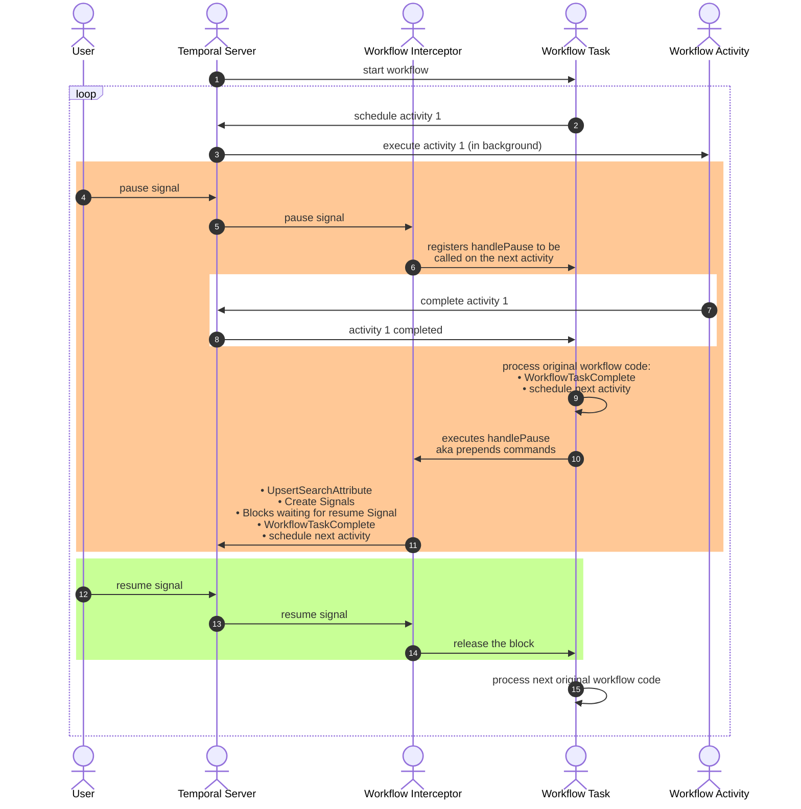

# Pause Workflow via Signal
There's an open feature request for pausing/unpausing workflows: https://github.com/temporalio/temporal/issues/3006. 
This sample is a workaround until the feature is implemented. 

This is build using workflow interceptors, and registers `pause` and `resume` signals.

We can selectively apply this interceptor to workflows types by passing in the workflow at creation of the interceptor.

This sample includes adding a SearchAttribute called `Paused` can be used to query for workflows in the paused state.
If you don't need to query for them, you can remove any references to SearchAttributes and skip step 2, creating the SearchAttribute.


# Steps to run this sample:
1) Run a [Temporal service](https://github.com/temporalio/samples-go/tree/main/#how-to-use).
2) Create the SearchAttribute `Paused`
   ```bash
   temporal operator search-attribute create --name Paused --type Bool
   ```
3) Run the following command to start the worker
    ```
    go run pause-workflow-via-signal/worker/main.go
    ```
4) Run the following command to start the example
    ```
    go run pause-workflow-via-signal/starter/main.go
    ```
5) Pause or Resume the workflow by running
    ```bash
    temporal workflow signal -w pause_workflow_ID --name pause
    temporal workflow signal -w pause_workflow_ID --name resume
    ```
6) Query for paused workflows
   ```bash
    temporal workflow list --query "Paused = true"
   ```


Note, there's an interesting behavior if you send `pause, resume, pause` 
very quickly (or before a worker can pick it up), which will let 1 activity through.
An analogy of each signal send can be thought of like `time.Tick()`.

Here's a detailed sequence of how it works.



It's possible to change the behavior so that a sequence of `pause, resume, pause` will not let any activities through,
however this feels wierd to do, like you're racing the clock.
